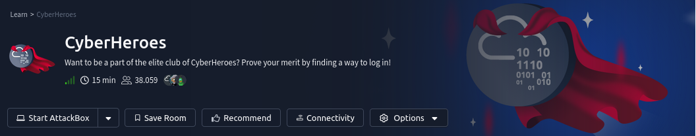
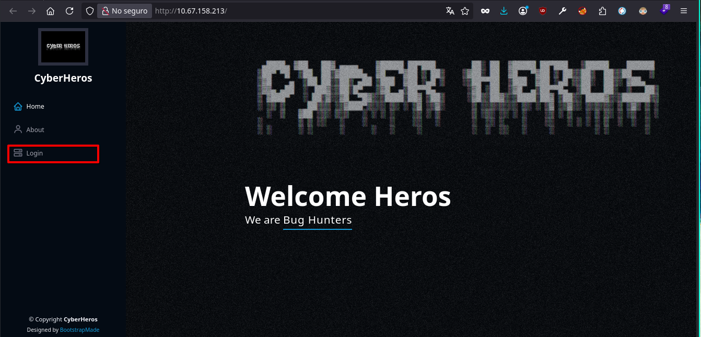
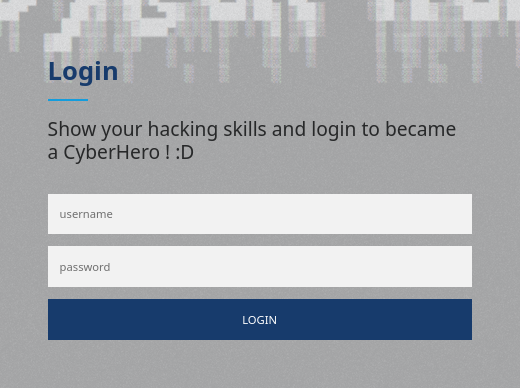
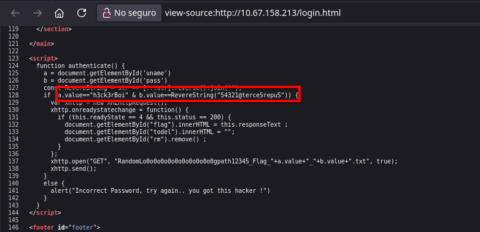
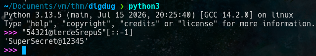
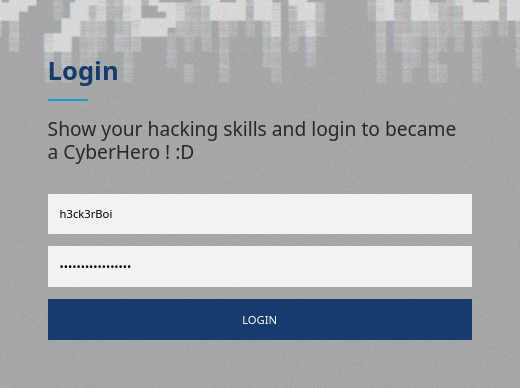
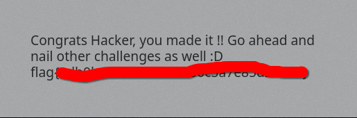

## Contexto
Want to be a part of the elite club of CyberHeroes? Prove your merit by finding a way to log in!
## Preguntas
- Uncover the flag!
## Solucion
Ingresamos al servicio web y visualizamos lo siguiente.

vemos que hay un apartado de login y accedemos ahi.

Debemos buscar credenciales validas...

En este caso basto con hacer *"ctrl+u"* para revisar el codigo html.

En donde podemos ver codigo js que se utiliza para hacer la autenticacion.

Entonces tenemos de username **"h3ck3rBoi"** y una contraseña al reves que volteamos a continuacion.

Ingresamos las credenciales "**h3ck3rBoi:SuperSecret@12345**" y obtenemos la flag.

