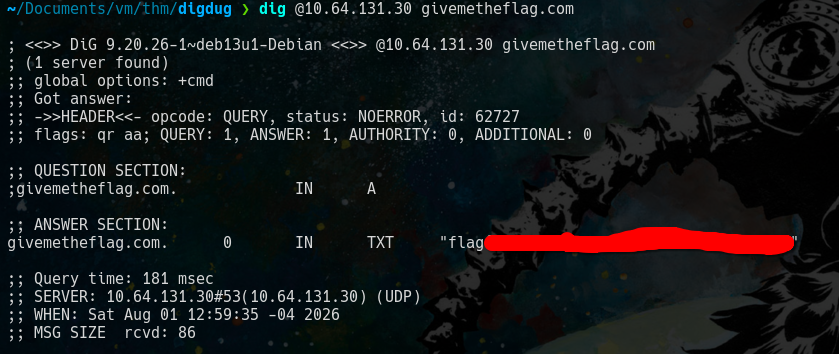

## Contexto
Oooh, turns out, this MACHINE_IP machine is also a DNS server! If we could dig into it, I am sure we could find some interesting records! But... it seems weird, this only responds to a special type of request for a givemetheflag.com domain?

## Preguntas
- Retrieve the flag from the DNS server!

## Solucion
Siguiendo la pista que nos da el enunciado usaremos la herramienta dig.

**dig** sirve para hacer consultas a servidores DNS y ver como resulve los dominios

"*dig @IP_SERVE_DNS DOMINIO*"

