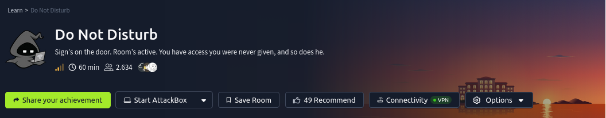
# Contexto
Sign's on the door. Room's active. You have access you were never given, and so does he.

The anomalies stop being anomalies: a session goes warm on a sunbed, and a stranger sits down in it, a wallet signs a transaction its owner didn't authorise, a shell on the beach answers back. And it becomes clear that whoever's already inside has been moving for far longer than you have.

The Byte Lotus poolside platform tracks every cabana, every sunbed, every warm session. Byte Lotus never forgets. Someone is already inside. Follow his footprints in, climb the way he climbed, and recover both flags.

# Preguntas
- What is the user flag?
- What is the root flag?

# Solucion
## nmap
Escaneo de puertos abiertos.

    sudo nmap -p- --open -sS --min-rate 5000 -n -Pn -vvv 10.67.191.252 -oG nmap

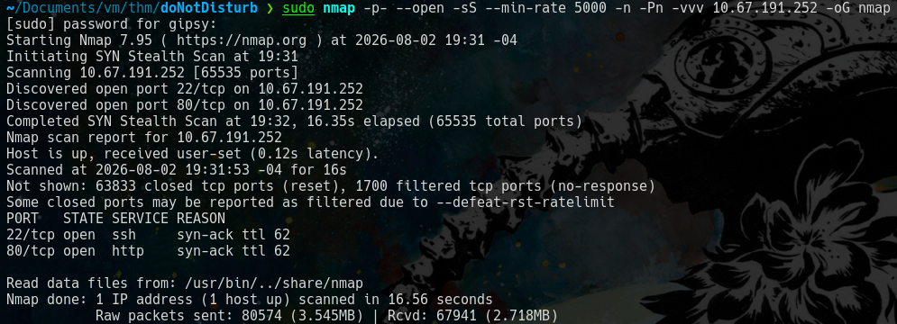

Determinamos los servicios que corren en los puertos abiertos.

    sudo nmap -p22,80 -sCV 10.67.191.252-oN ports
    
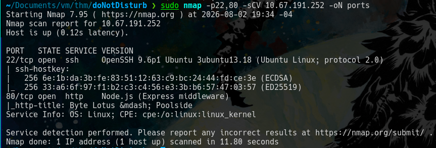

## web
Accedemos al servicio web.

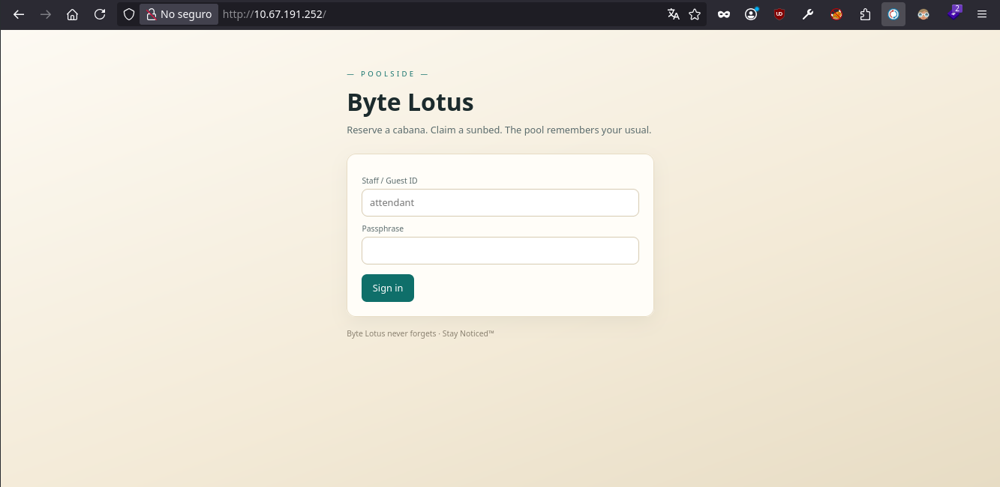

### Caido
Capturamos la peticion que se realiza al oprimir el boton *"sign in"*.
Para esto usamos el *"intercept"* de caido

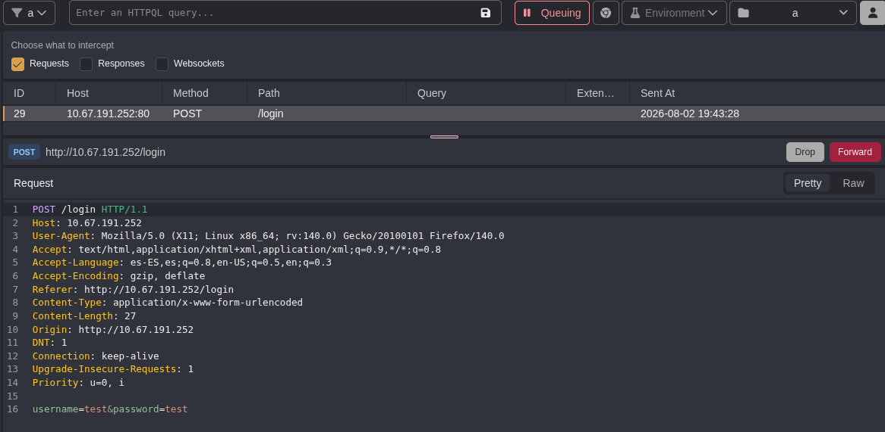

Modificamos la peticion aplicando "**nosql injection**" y oprimimos "*Forward*" para enviar la peticion modificada.

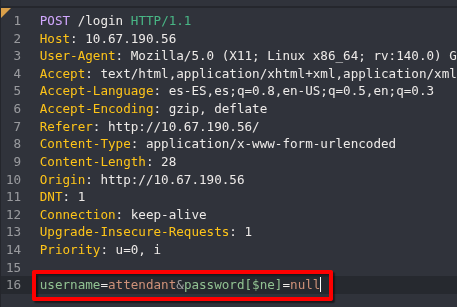

Nos redirige a **"/staff"**

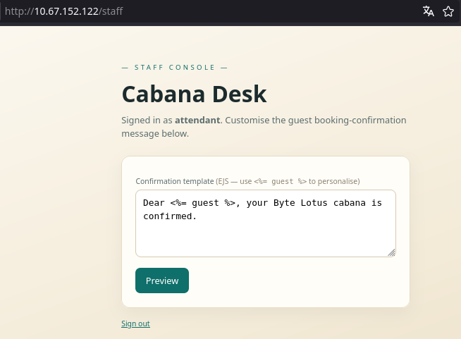

### SSTI
En esta parte vemos que se ejecuta la instruccion "*<%= guest %>*" y se convierte en *"attendant"*

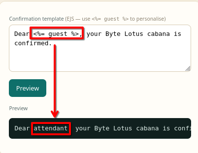

Identificamos que tipo de template se utiliza, causando un error.

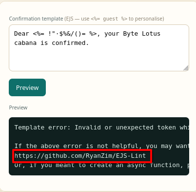

En el error nos identifica el template que se uso. Haciendo una busqueda en internet llegue a esta pagina https://www.vulnsy.com/cheat-sheets/ssti

Entonces nos ponemos en escucha con "**nc**" y ejecutamos una revershell.

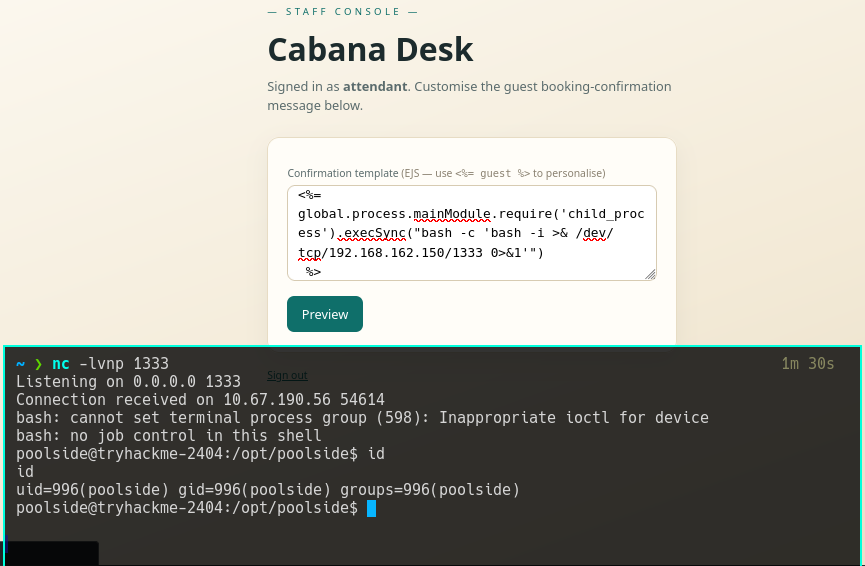 

## Respuesta a 'What is the user flag?'

Una vez obtenida la shell nos dirigimos a nuestro directorio home y vemos la bandera.

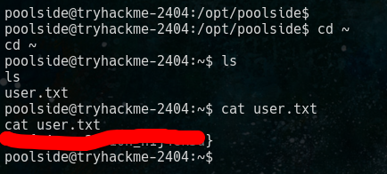

## Escalada de privilegios
### Puertos abiertos internamente
Revisamos los puertos abierto internamente.

    ss -tunlp

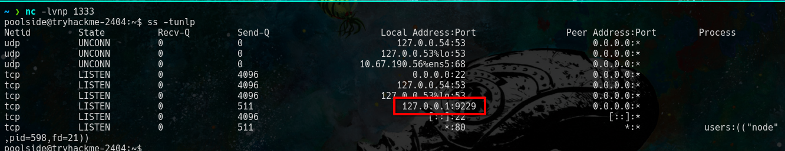

### Procesos corriendo
Usaremos la herramienta de **"pspy64"**.

Desde la maquina atacante, primero creamos un servidor python en la carpeta donde tenemos el archivo pspy64 para transferirnos el archivo entre las maquinas.
    
    python3 -m http.server PORT

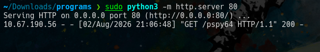

Desde la maquina victima nos descargamos el archivo, le damos permisos, y ejecutamos.

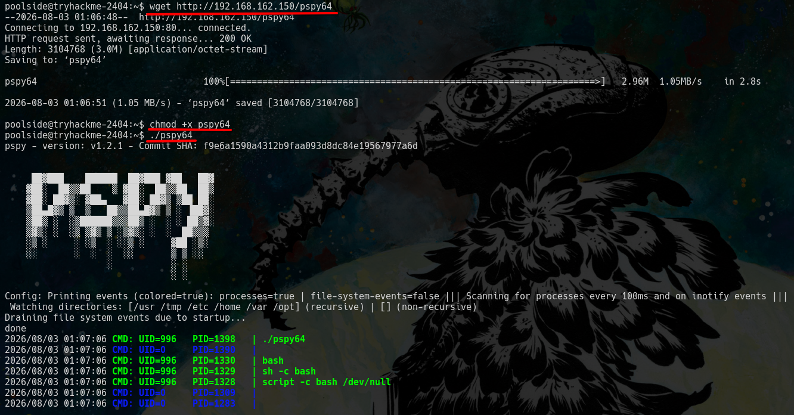

Pspy nos mostrara que procesos estan corriendo actualmente, entre ellos uno nos llama la atencion.

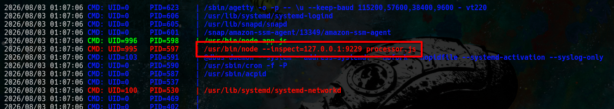

Entonces tenemos un puerto abierto *9229* y un proceso que se inicia asi *"/usr/bin/node --inspect=127.0.0.1:9229 processor.js"*

Revisando esta pagina https://nodejs.org/learn/getting-started/debugging , en resumen nos dice que al hacer esto *'node --inspect=127.0.0.1:9229 script.js'* se inicia un debugger y para conectarnos al debugger usamos

    node inspect 127.0.0.1:9229

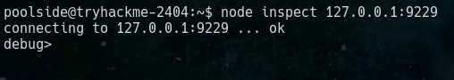

### Escalando a pipelinesvc
En este debugger podemos ejecutar scripts y por ende podemos ejecutar comandos.

Entonces en otra terminal nos ponemos en escucha con "**nc**" y nos pasamos una shell.

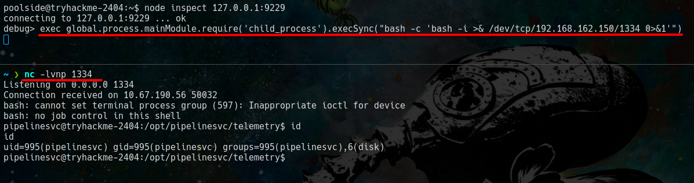

## Respuesta a 'What is the root flag?'

Revisamos a que grupos pertenecemos.

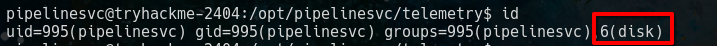 

Vemos que pertenecemos a "**disk**".

Revisamos esta pagina https://caramellia.medium.com/privilege-escalation-via-disk-group-membership-daa75a7cd930 para hacer lo siguiente.

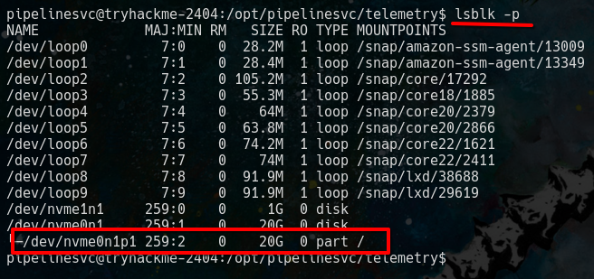

Y finalmente ejecutamos lo siguiente para ver la flag.

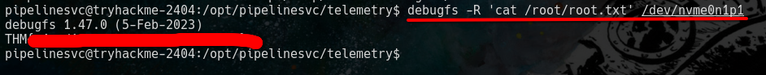

p.d. tuve muchos problemas para completar el reto muchas veces las maquinas se trababan y las reiniciaba je je 