# Contexto
Byte Lotus Hotel promises a seamless stay powered by modern technology. Sometimes the most interesting systems are the ones guests were never meant to see.

# Preguntas
- What is the user flag?
- What is the root flag?

# Solucion

## Web
Accedemos al servicion web.

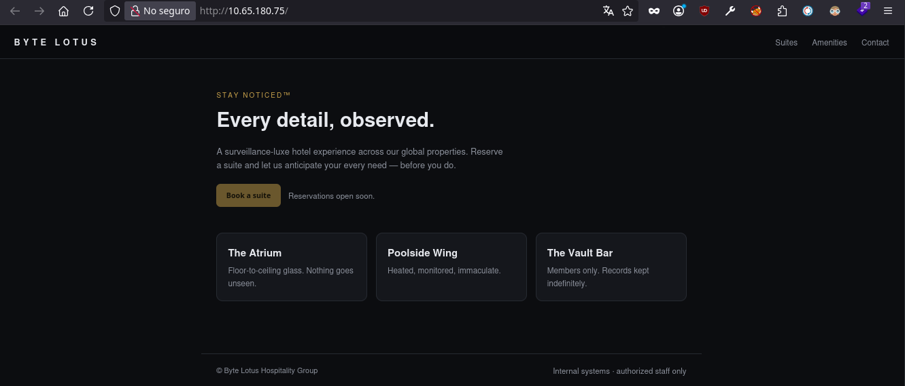

### Fuzzing
Para esta parte usaremos **'gobuster'** para hacer el fuzzing.

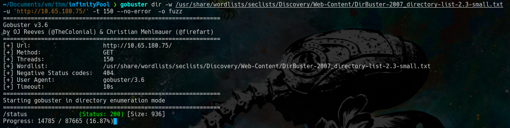

Encontramos el endpoint **'status'** y vemos que podemos hacer ping a direcciones que introduzcamos.

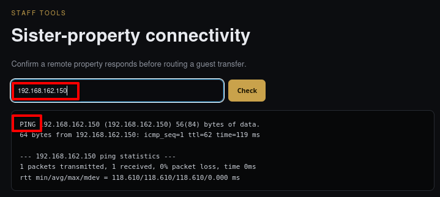

Intentamos introducir **';'** para ejecutar comandos y tuvimos exito.

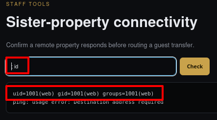

Intentamos pasarnos un revershell con bash.

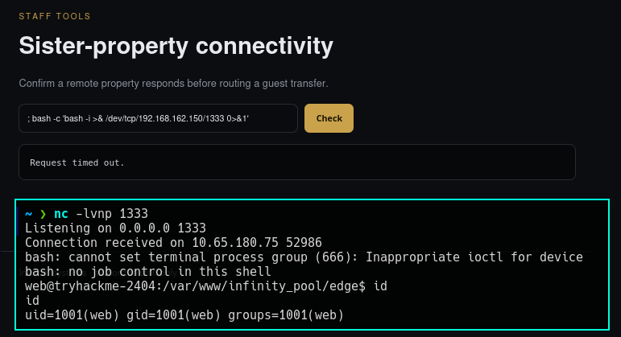

## Respuesta a 'What is the user flag?'

Obtuvimos acceso a la maquina con el usuario **'web'**, nos vamos a nuestro directorio home y podemos ver la bandera.

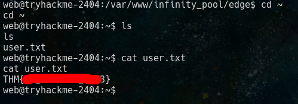

## Ssh
Para trabajar mejor nos creamos persistencia en el equipo, para poder tener una terminal mas facil de usar. 

De nuestra maquina atacante copiamos nuestra clave publica en el archivo **'authorized_keys'** de la maquina victima.

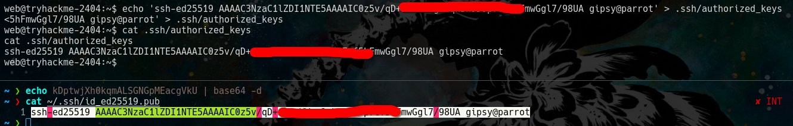

Esto para conectar por ssh sin necesidad de ingresar credenciales.

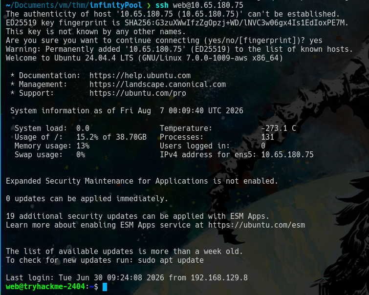

## Procesos corriendo

Para esta parte usaremos **'pspy64'** para poder ver los procesos que estan en ejecucion.

Asi que primero nos creamos un servidor http con python en nuestra maquina atacante.
 
    sudo python3 -m http.server PORT

Desde la maquina victima nos descargamos el recurso.

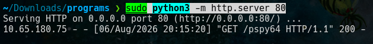

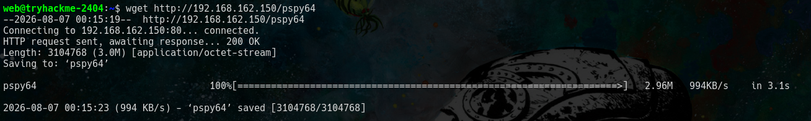

Le damos permisos de ejecucion y corremos la herramiento.

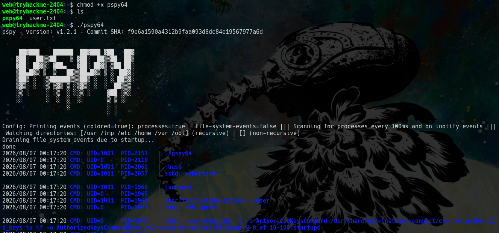

Hay dos procesos que nos llaman la atencion.

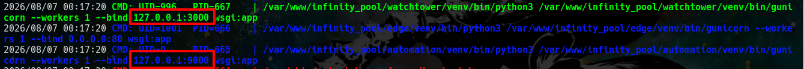

Estos procesos crean servicios en los puertos **'3000'** y **'9000'** visibles de manera local.

## Port forwarding

Manejaremos **'chisel'** para poder acceder a los puertos abierto en la maquina victima en nuestra maquina atacante.

Primero creamos un servidor con chisel en nuestra maquina atacante.
    
    chisel server -p PORT --reverse

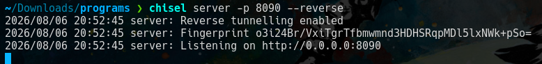

Chisel tiene una version como binario asi que nos la pasamos a la maquina victima con el servidor python que creamos anteriormente.

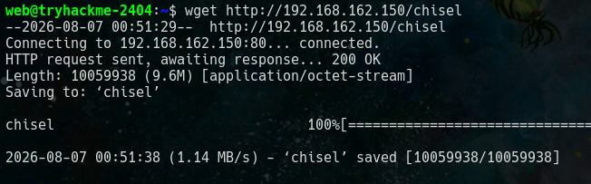

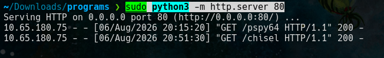

Le damos permisos de ejecucion y usamos chisel en modo cliente para los puerto 3000 y 9000.

    ./chisel client IP_SERVER:PORT_SERVER R:PORT_ATACANTE:IP_VICTIMA:PORT_VICTMA
    
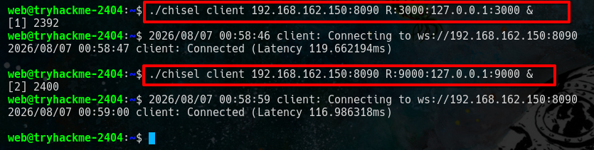

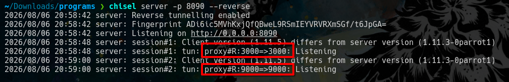

Desde nuestra maquina atacante ya podemos acceder.

### port 3000

Revisamos el puerto 3000 accediendo asi **'127.0.0.1:3000'**. Desde el navegador podemos ver un par de **'endpoints'**.

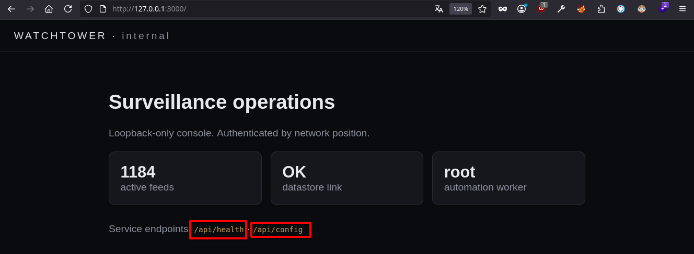

Revisando los endpoint obtenemos la siguiente informacion.
- "telephony_pass": "St4yN0t1c3d_2026",
- "telephony_portal": "http://127.0.0.1:8080/ucp",
- "telephony_user": "FreePBXUCPTemplateCreator"

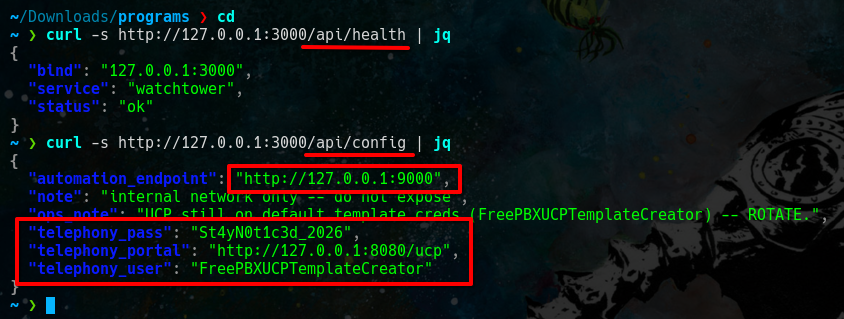

De la informacion obtenida destaca un nuevo puerto **'8080'** que no contemplamos, un usuario, una contraseña y un endpoint para el puerto 8080 **'/ucp'** .

Con chisel volvemos a hacer lo mismo que inicimos con el puerto 3000 y 9000.

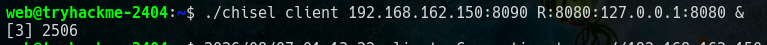

### port 9000
Revisamos el puerto y vemos que no hay nada en **'/'**. 

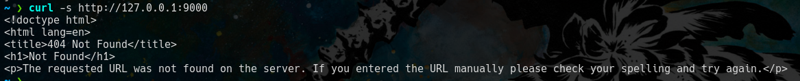

Hacemos fuzzing para descubrir endpoints.

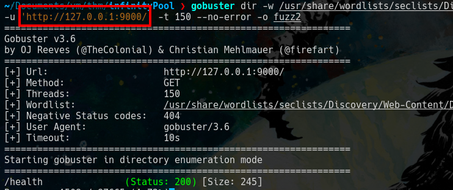

Obtenemos el endpoint **'health'**, revisamos su contenido.

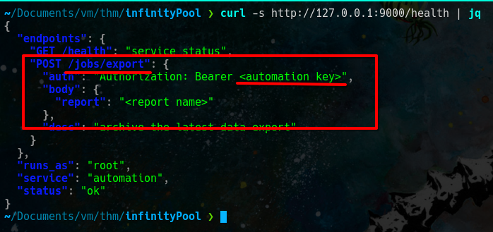

La informacion mas relevante es el endpoint **'/jobs/export'** y tambien que necesitamos un **'automation key'** que no tenemos aun.

### port 8080
Revisamos el puerto con el endpoint que nos salio al revisar el puerto 3000.

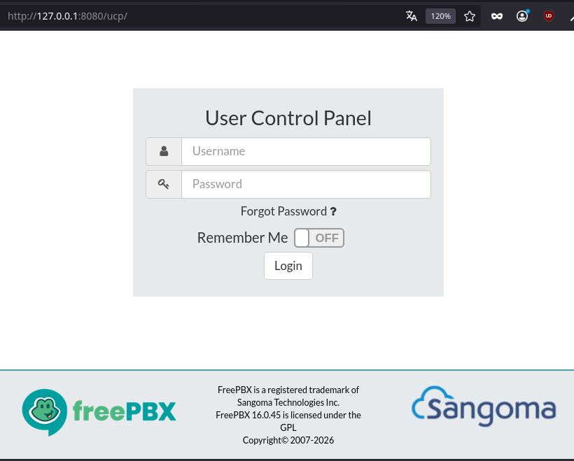

Ingresamos a la credenciales que encontramos en el puerto 3000.

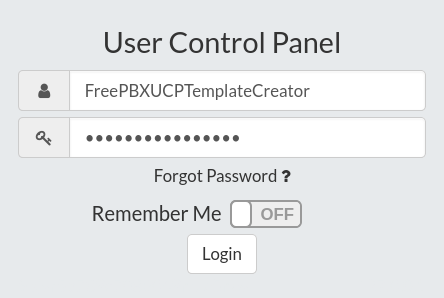

Al ingresar se ve asi. Ahora seguimos los siguientes pasos, hacemos click en el simbolo **'+'**.

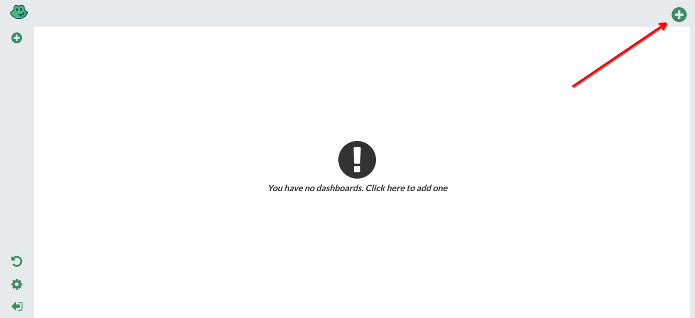

Le damos un nombre y click en el boton **'create dashboard'**.

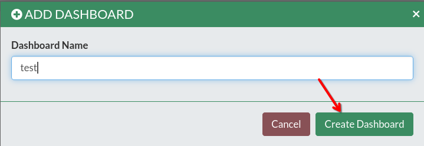

Luego hacemos click en el simbolo **'+'**.

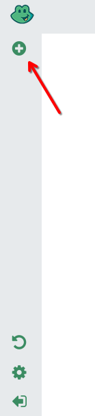

Nos vamos a *'voicemail'* y hacemos click en el simbolo **'+'**.

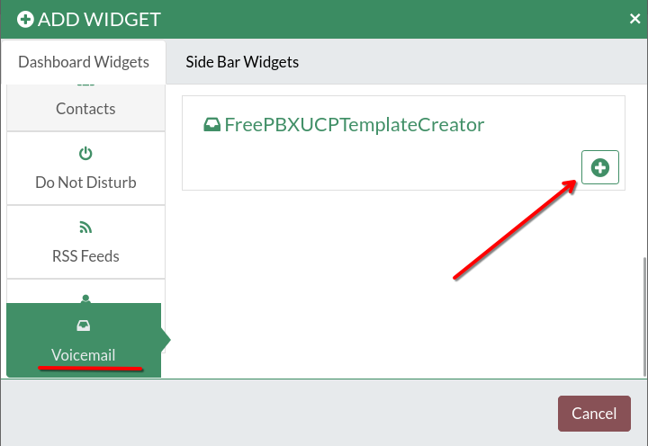

Entonces podemos ver el **'automation key'** que no teniamos para el puerto 9000.

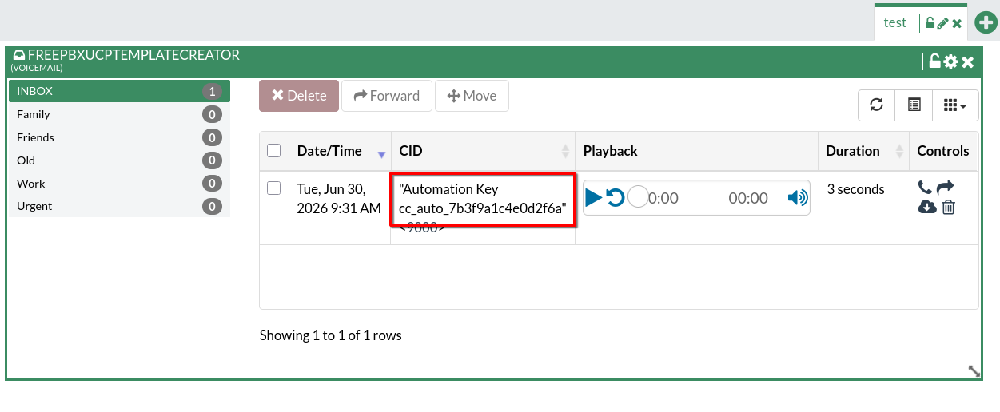

Accedemos a **'/jobs/report'** con metodo POST y vemos que necesita un **'report'**.

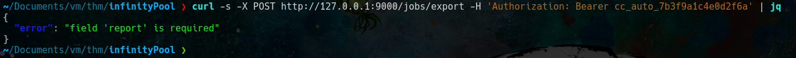

Asi que lo intentamos de nuevo, agregamos el *'report'* segun las instrucciones que obtuvimos del puerto 9000.

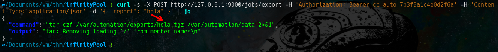

Notamos que el nombre que ingresamos se paso tal cual al resultado de la peticion.

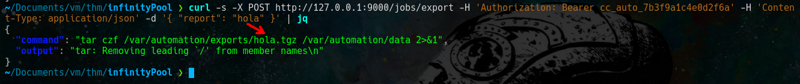

Asi que intentamos agregar un **';'** para ver si podemos ejecutar comandos.

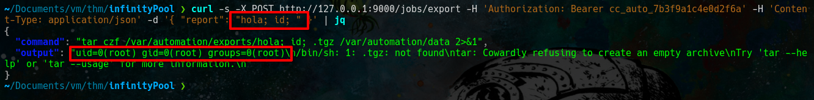

Al final usamos el *';'* dos veces y vemos que se ejecuta el comando id. Ahora nos enviamos una revershell.

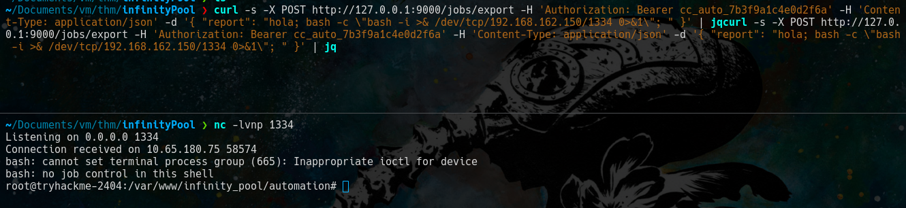

## Respuesta a 'What is the root flag?'
Nos dirigimos a directorio /root y podemos ver la flag.

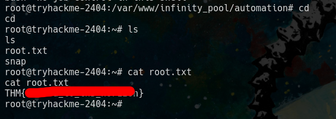 