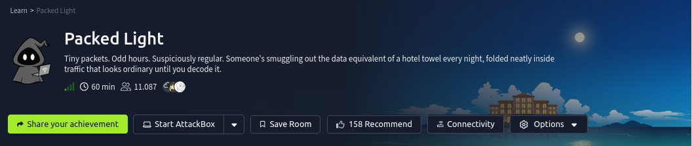

# Contexto
Tiny packets. Odd hours. Suspiciously regular. Someone's smuggling out the data equivalent of a hotel towel every night, folded neatly inside traffic that looks ordinary until you decode it.

A short capture from the guest network is all VERA could pull before the connection dropped. Somewhere in that traffic, a quiet little errand is running on a loop, and it isn't part of any service the hotel actually offers.

# Preguntas
- What is the flag?

# Solucion
Descomprimimos el zip del reto y obtenemos un archivo **'traffic.pcapng'** que habriremos en **wireshark**.

## Wireshark
Al abrir el archivo se ve asi:

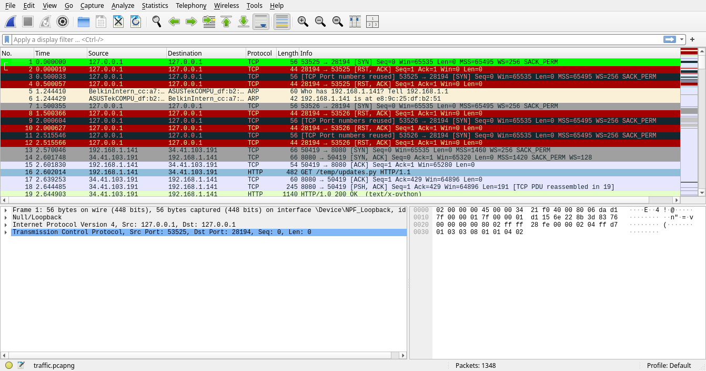

Primero determinamos que ip's tienen mas participacion en el archivo *'pcapng'*.

Nos dirigimos a *'Stistics -> Conversations '*

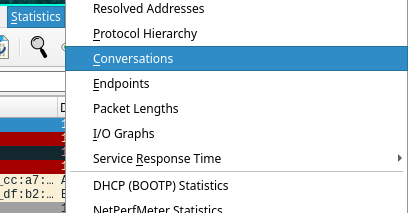

Nos dirigimos a la pestaña *'IPv4'*, ordenamos segun los *'packets'* y en este caso no quedamos con las ip's **"192.168.1.141 y 34.41.103.191"**.

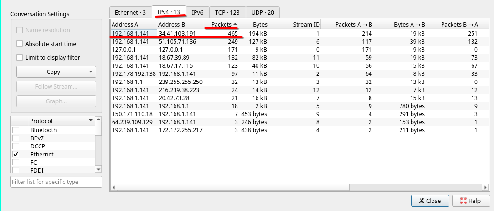 

Filtramos segun la ip **'34.41.103.191'**  para ver los paquetes en donde esta ip estuvo involucrada.
    
    ip.addr eq 34.41.103.191

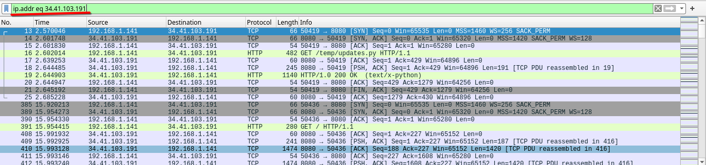

De estos paquete revisamos que protocolos fueron mas usados, nos vamos a *'Statistics -> Protocol Hierarchy'*.

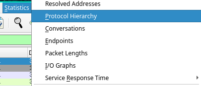

El protocolo que nos llama la atencion es **'Hypertext Transfer Protocol'** ya que rapidamente lo podemos a asociar a un servicio web, que usa html o algo similar.

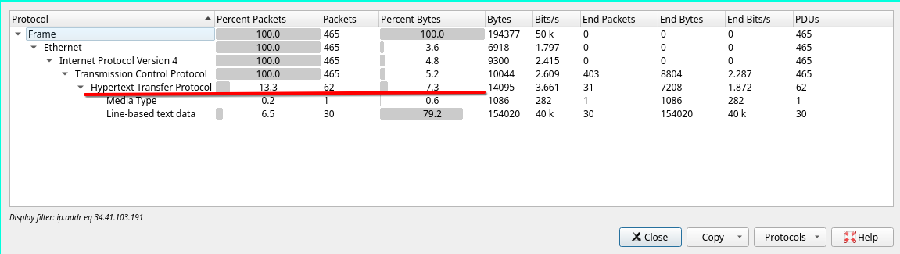

Y agregamos otro filtro para el protocolo.

    ip.addr eq 34.41.103.191 && http 

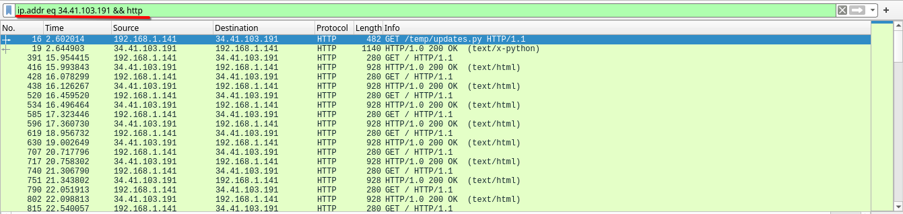

Nos vamos a *'File -> Export Objects -> http...'*.

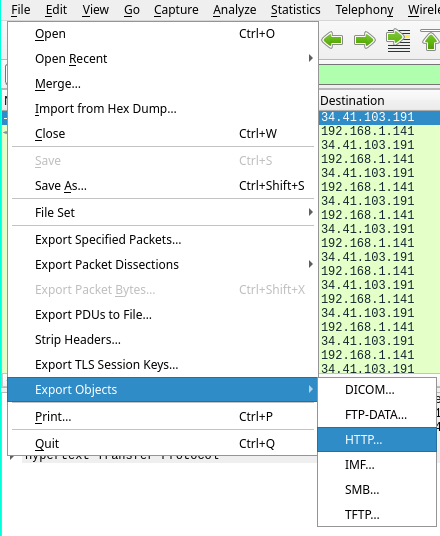

Entonces podemos ver objetos http en los paquetes, el archivo que nos interesa es el **'updates.py'** y lo guardamos.

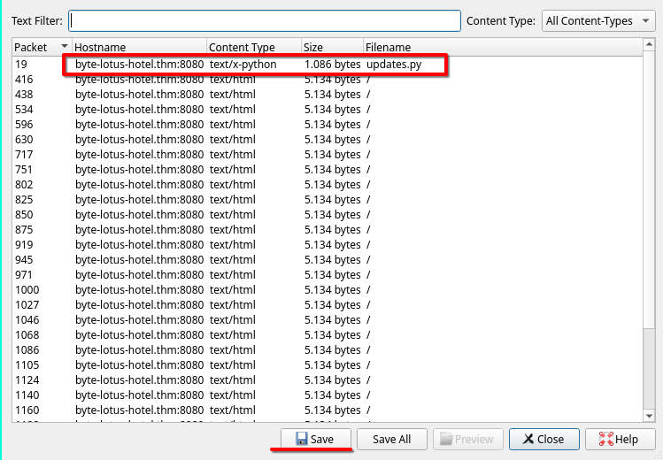

Puede analizar el *'updates.py'* de cualquier forma que desees, lo importante es que es un script que simula un kelogger que cifra cada caracter y lo envia a una url atravez de las cookie en cada peticion.

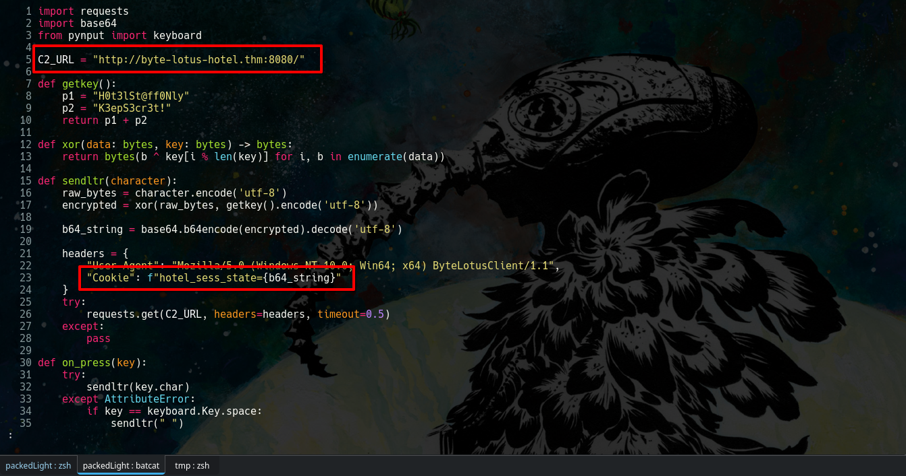

Si revisamos los otros paquetes del wireshark y revisamos las cookies parecen ser caracteres sin sentido, pero gracias al archivo '*updates.py*' sabemos que es un caracter cifrado.

## Tshark

con tshark filtramos los paquetes para quedarnos con las cookies.

    tshark -r traffic.pcapng -Y "http.request" -T fields -e http.cookie 

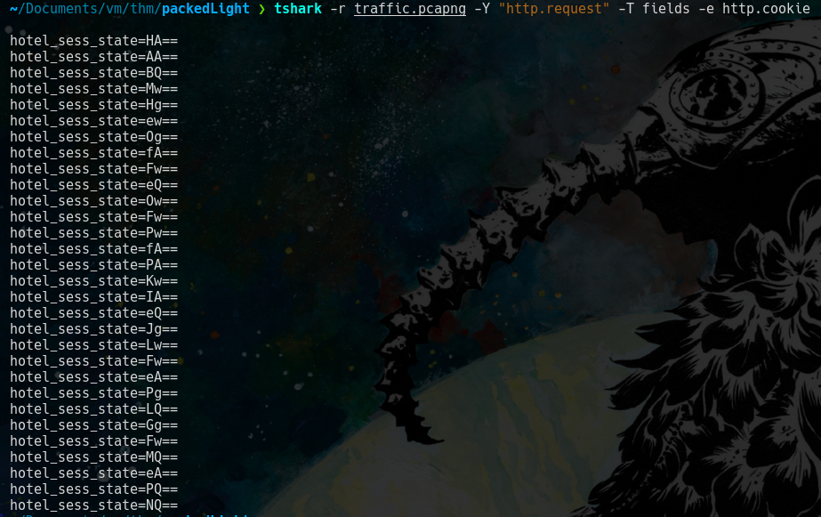

Con la terminal filtramos las cadenas para quedarnos con las partes que nos interesa.

    tshark -r traffic.pcapng -Y "http.request" -T fields -e http.cookie | cut -d "_" -f3 | sed 's/state=//'  

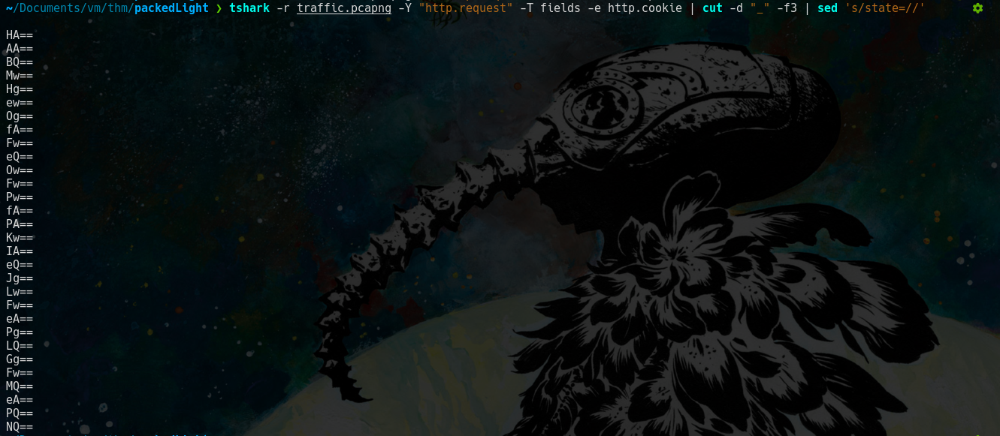

## Respuesta a 'What is the flag?'

Segun el archivo *'updates.py'* el cifrado es en este orden 

- caracter normal
- cifrado xor
- cifrado base64
- caracter cifrado

Para el cifrado xor se usa la siguiente key.

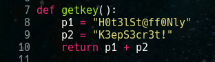

Para realizar el proceso inverso se puede hacer con cyberchef o un script propio.

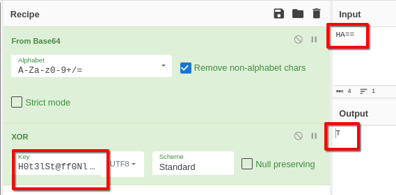

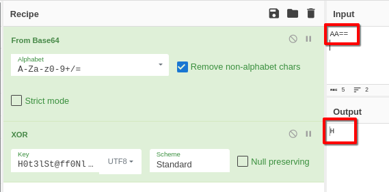

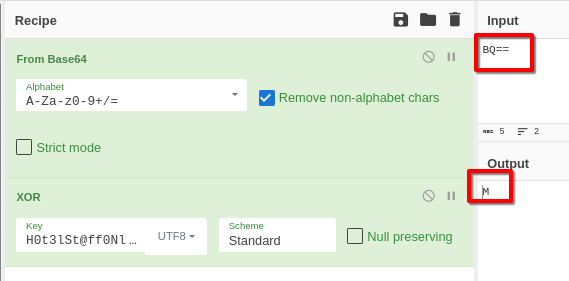

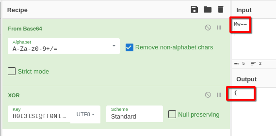

Pero el proceso es lento con cyberchef, asi que usare un script proporcionado por la IA para obtener la flag.

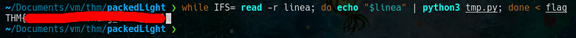