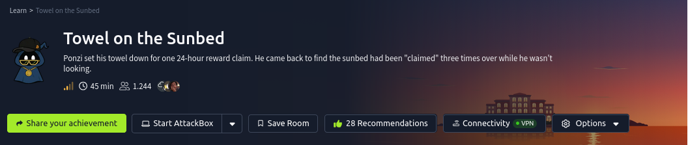
# Contexto
Ponzi found the resort's wellness portal running a little side project called Ponzi — a crypto rewards app, poolside edition. He set his towel down, claimed his daily reward, and went to reapply sunscreen. He came back to find the sunbed had been "claimed" three times over while he wasn't looking.

He's convinced the app owes him a spot in the Whale Vault. The app disagrees, politely, once every 24 hours. Somewhere between his request and the server's clock, there's a gap wide enough to walk a whale through.

# Preguntas
- What is the flag?

# Solucion
## nmap 
Hacemos escaneo de puertos abiertos a la maquina victima.

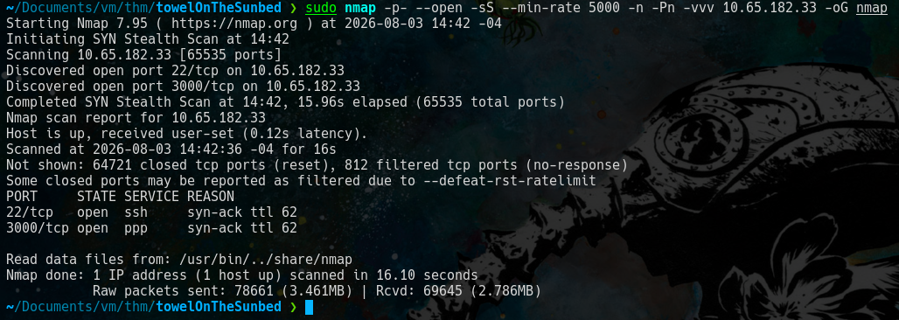

Verificamos servicios que corren en los puertos abiertos.

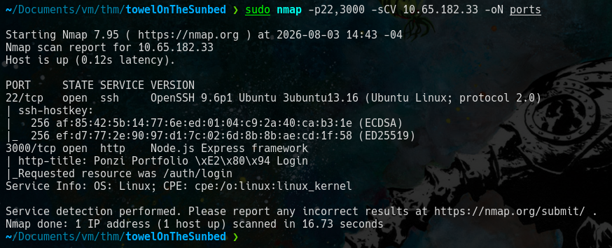

## web
Accedemos al servicio web en el '**puerto 3000**'

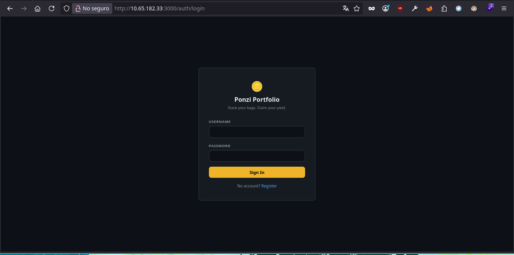

Se intento *'sql injection'* pero no tuvo efecto, asi que nos registramos.

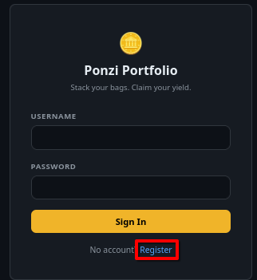

Usamos la credenciales *'test:123456'*

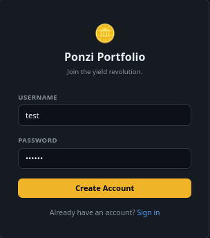

Accedemos a *'/dashboard'*

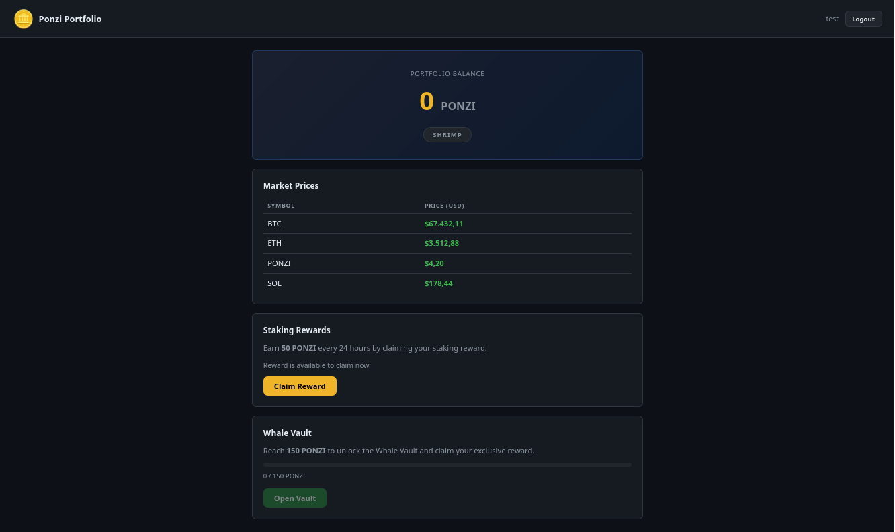

En esta pagina tenemos un boton **'/Claim Reward'**.

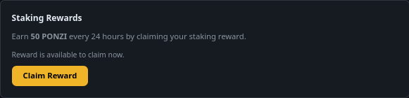

Al oprimirlo se desactiva el boton y tenemos un tiempo de espera para volver a presionar el boton.

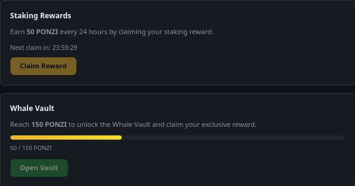

Intentamos de activar el boton modificando el html eliminando el atributo **'disabled'** del boton.

Pero me nos sale el siguiente mensaje *'Reward already claimed. Please wait before claiming again.'*

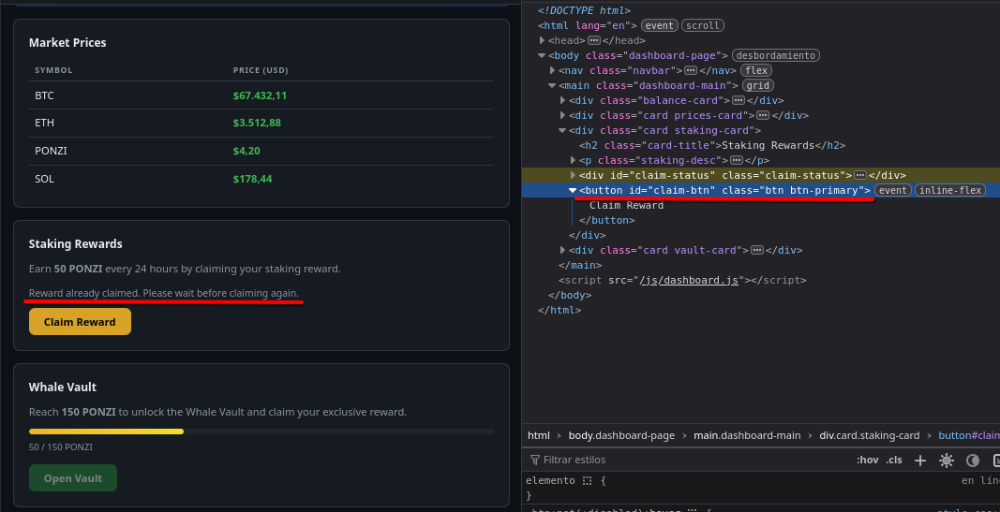

Intentamos la accion del boton con '**curl**'

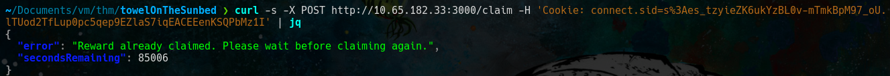

Pero no obtenemos resultados...

Revisamos el *'depurado'* del navegador y vemos estas lineas del script **'dashboard.js'**

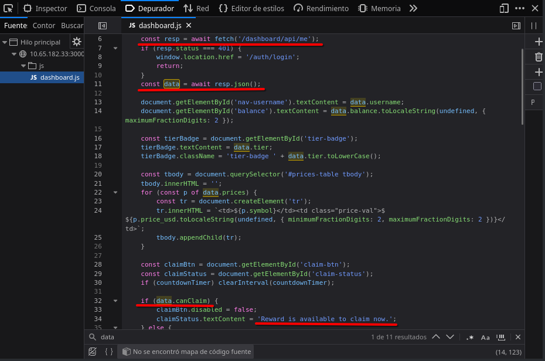

Estas lineas nos dicen que se verifica **data.canClaim** para permitir reclamar los *'PONZI'* el valor de *'canClaim'* se obtine de '**/dashboard/api/me**'.

Usamos **curl** para verificar la ruta '**/dashboard/api/me**'.

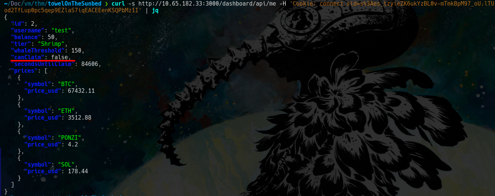

y vemos que el valor es **false**.

Despues de intentar buscar alguna manera de cambiar ese valor a *'true'* se intento otra cosas totalmente diferente. 

Se intento explotar este problema en entornos informaticos https://www.geeksforgeeks.org/operating-systems/race-condition-in-operating-systems/ en teoria.

### Caido
Interceptamos la peticion que se realiza al oprimir el boton.

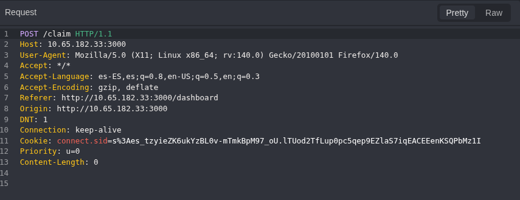

Cerramos la session que creamos anteriormente para **crear otra cuenta** con las credenciales **'test3:123456'**

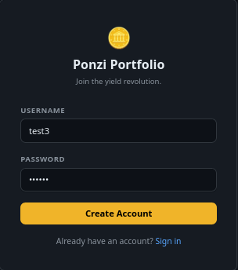

En aqui aun no oprimimos el boton.

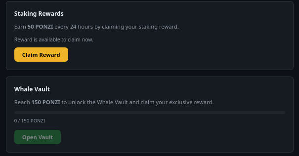

Obtenemos la cookie de esta cuenta.

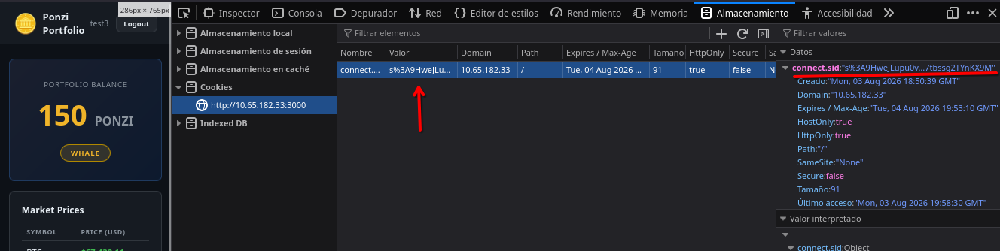

Enviamos la peticion interceptada al **'Automate'** de caido y **cambiamos** la *antigua cookie* con la *nueva cookie* en la peticion interceptada. 

En donde lo ponemos en **parallel**, type en **Null Payload** y enviamos 10

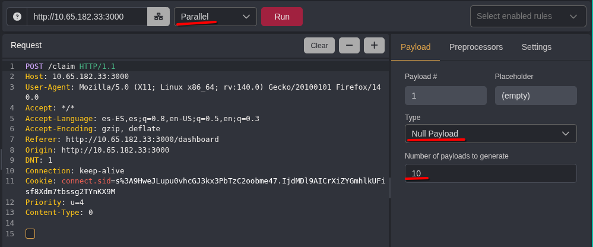
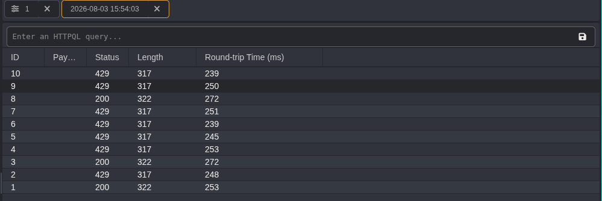

Recargamos la pagina.

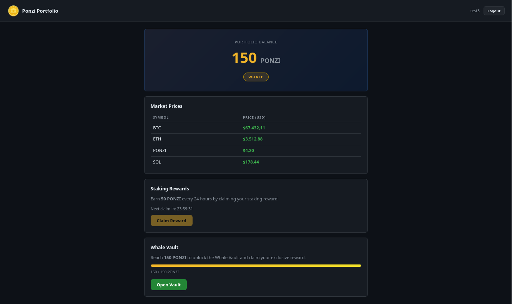

## Respueta a 'What is the flag?'
Oprimimos el boton **'Open Vault'** y vemos la flag.
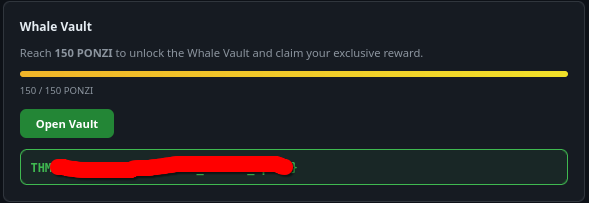