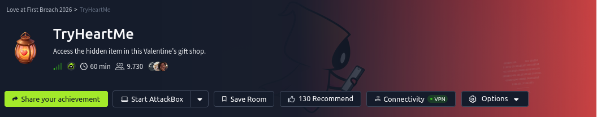

# Contexto
My Dearest Hacker,

The TryHeartMe shop is open for business. Can you find a way to purchase the hidden “Valenflag” item? 

# Preguntas
- What is the flag?

# Solucion
## Nmap
Escaneamos en busca de puertos abiertos.

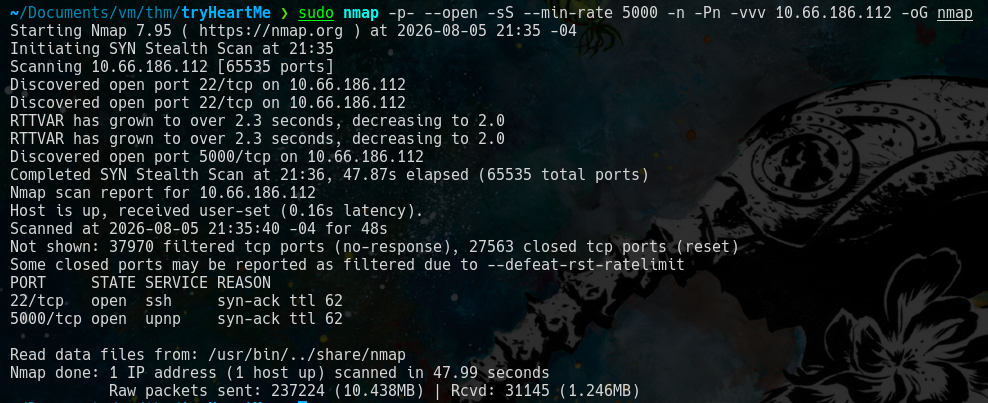

Buscamos que servicios corren en los puertos abierto.

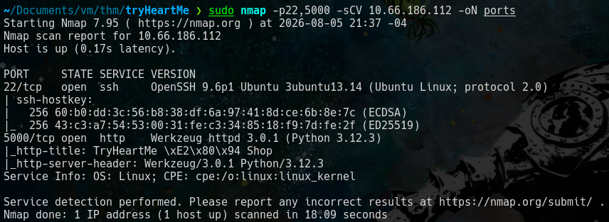

## WEB
Accedemos al servicio web por el puerto 5000.

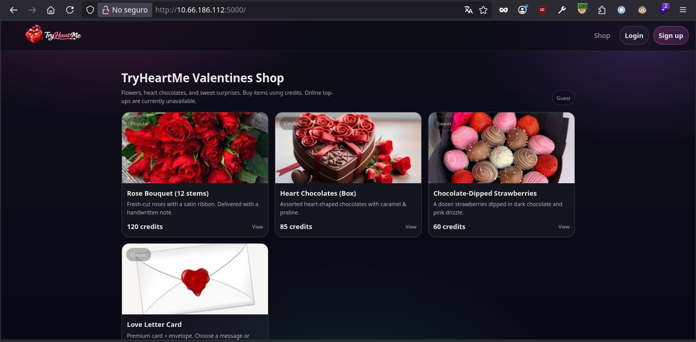

Nos creamos una cuenta en el **'sign up'** con credenciales **'a@a.a:123456'** .

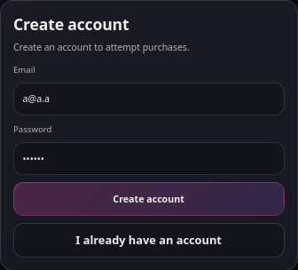

Seleccionamos un producto, vemos que no tenemos creditos y tenemos un rol. Ademas hay un boton para comprar **'buy'**

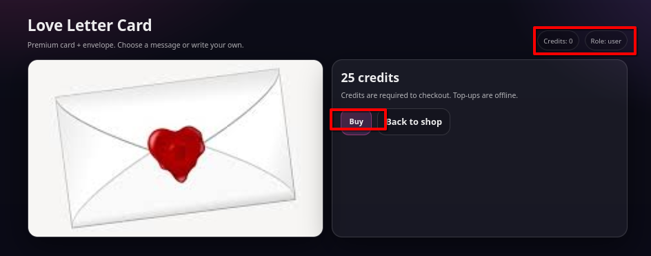

## Caido
Interceptamos las peticiones para ver como se gestiona la accion de compra.

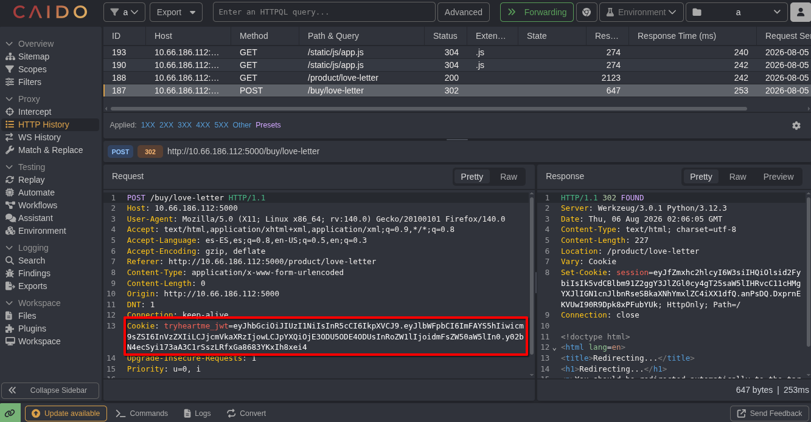

Lo mas relevante es el metodo de peticion **'POST'**, el enpoint **'/buy/love-letter'** y la cookie que parece ser un **'JWT'**.

Analizamos el *'JWT'*.

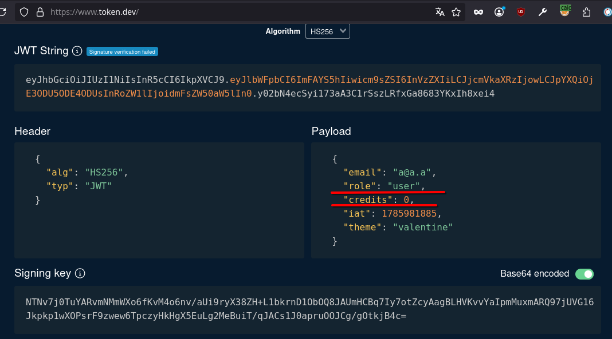

Confirmamos que es un *'JWT'*, asi que intentamos un ataque que solo consiste en cambiar los valores de **'role'** y **'credits'**. Algunas paginas no verifican la autenticidad de la **'key'** y este es el caso.

Cambiamos el valor de role por **'admin'** y el valor de credits  por **'2000'**.

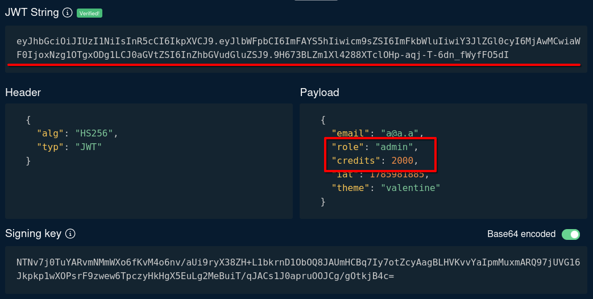

Copia el nuevo *'jwt'* que producimos y reemplazamos la cookie desde el navegador.

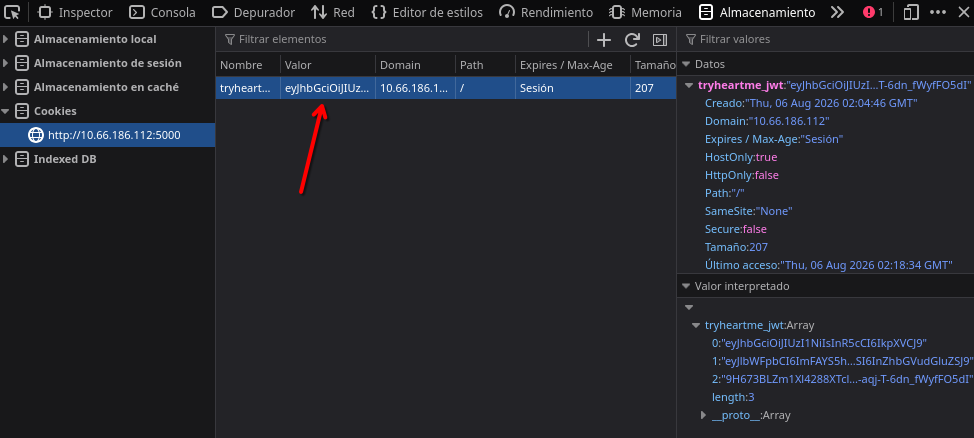

Recargamos la pagina y vemos un apartado de admin, tenemos mas creditos y vemos el producto **'valeflag'**.

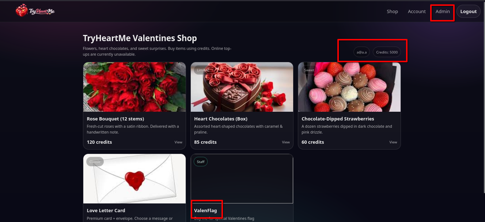

seleccionamos el producto de nuestro interes y lo compramos.

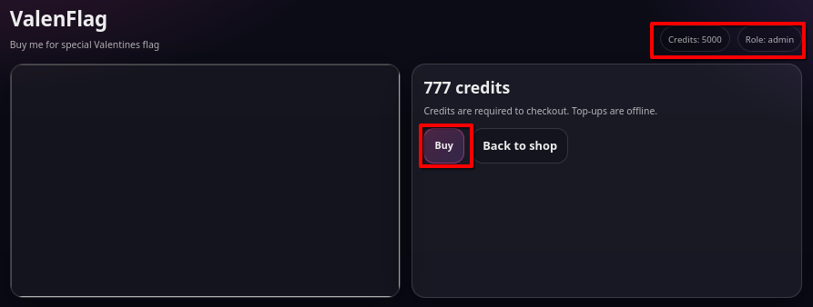

## Respuesta a 'What is the flag?'
Oprimimos el boton de **'buy'** y obtenemos la flag.

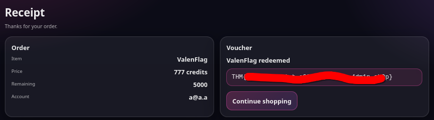